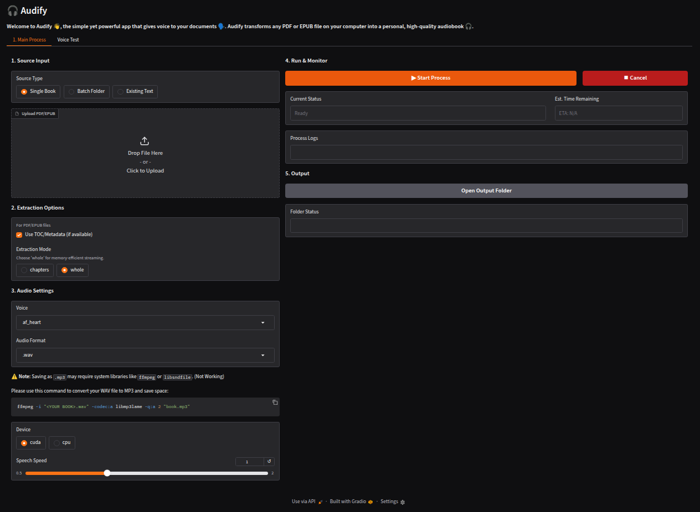

# 🎧 Audify: Your Personal Audiobook Creator

Audify is a simple yet powerful desktop application that transforms your PDF and EPUB files into high-quality audiobooks. Whether you're commuting, exercising, or just prefer listening to reading, Audify gives voice to your documents, making content consumption more accessible and enjoyable.

### 🗣️ Features

  * **PDF & EPUB Support**: Convert your favorite books and documents from both PDF and EPUB formats.
  * **Multiple Extraction Modes**:
      * **Whole Book (Streaming)**: Efficiently processes and generates audio for entire books, optimized for memory usage.
      * **Chapters**: Extracts text and generates audio chapter-by-chapter, ideal for structured content.
  * **Table of Contents (TOC) Integration**: Utilizes existing TOC data in PDFs for accurate chapter segmentation.
  * **Heuristic Chapter Splitting**: For documents without a TOC, Audify intelligently attempts to split content into logical chapters.
  * **Advanced Text Cleaning**: Normalizes text, expands abbreviations, converts numbers to words, and removes common document artifacts for a smoother listening experience.
  * **Multiple Voices**: Choose from a variety of available voices to personalize your audiobook.
  * **Adjustable Speech Speed**: Control the playback speed to match your listening preference.
  * **Cross-Platform (with Gradio)**: Built with Gradio, Audify provides a user-friendly web interface that can run locally on Windows, macOS, and Linux.
  * **GPU Acceleration**: Leverage NVIDIA GPUs (CUDA) for faster audio generation.

-----

## Getting Started

### Prerequisites

Before you begin, ensure you have the following installed:

  * **Python 3.8+**: Audify is built with Python.

  * **ffmpeg (Optional, but Recommended)**: For converting `.wav` audio files to `.mp3` after generation. Audify itself currently only outputs `.wav` directly, but `ffmpeg` is crucial for post-processing to save space.

      * **Windows**: Download from [ffmpeg.org](https://ffmpeg.org/download.html) and add to PATH, or use `choco install ffmpeg`.
      * **macOS**: `brew install ffmpeg`
      * **Linux**: `sudo apt update && sudo apt install ffmpeg` (Debian/Ubuntu) or `sudo yum install ffmpeg` (Fedora/RHEL)

### Installation

1.  **Clone the repository:**

    ```bash
    git clone https://github.com/YOUR_USERNAME/Audify.git
    cd Audify
    ```

2.  **Create a virtual environment (recommended):**

    ```bash
    python -m venv venv
    # On Windows
    .\venv\Scripts\activate
    # On macOS/Linux
    source venv/bin/activate
    ```

3.  **Install the required packages:**

    ```bash
    pip install -r requirements.txt
    ```

    This may take a while as it includes large libraries like `torch` and `deepspeed`.

4.  **Download the `en_core_web_sm` spaCy model:**
    This model is used by some text processing components. It should be installed automatically via `requirements.txt`, but if you encounter issues, you can install it manually:

    ```bash
    python -m spacy download en_core_web_sm
    ```

-----

## How to Run

1.  **Activate your virtual environment (if not already active):**

    ```bash
    # On Windows
    .\venv\Scripts\activate
    # On macOS/Linux
    source venv/bin/activate
    ```

2.  **Start the Gradio application:**

    ```bash
    python gradio_app.py
    ```

-----

## Screenshot

